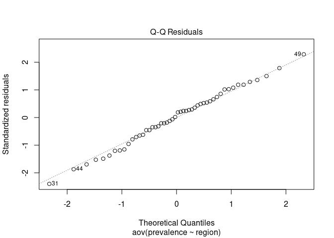

Final Project
================
Noah Blake
2025-10-28

- [R Markdown](#r-markdown)
- [Abstract](#abstract)
- [Background](#background)
- [Analysis](#analysis)
  - [1 Prevelance by Region](#1-prevelance-by-region)
  - [2 US Population density by
    region](#2-us-population-density-by-region)
  - [3 Asthma Prevelance by US State](#3-asthma-prevelance-by-us-state)

``` r
knitr::opts_chunk$set(echo = TRUE)
```

## R Markdown

## Abstract

## Background

Asthma is a chronic condition that causes airways to tighten up and
makes it harder to breathe. There are many pollutants that can be found
in the air, which contribute to this Asthma reaction. These include
Ozone, Nitrogen Dioxide, Sulfur Dioxide, Carbon Monoxide, and
Methane\[^1\]. These species react with cells in the body and break down
into reactive oxygen species, which are powerful oxidizers that damage
cellular tissue. This causes an inflammatory response, which restricts
the airways.

In the United States, there are many of these pollutants that are
released in different areas of the country as show below , which can
cause high rates of asthma to appear. The map below shows the prevalence
of asthma across different regions.

``` r
library(ggplot2)

ggplot(asthma_data, aes(x = region, y = prevalence)) +
  geom_boxplot() +
  labs(title = "Asthma Prevalence by U.S. Region",
       x = "Region",
       y = "Asthma Prevalence (%)") +
  theme_minimal()
```


Figure 1. Bar plot showing the median Asthma prevalence in each US
region along with outliars with the south with the lowest prevelance and
the Northeast at the highest.

``` r
library(maps)
library(ggmap)
```

    ## ℹ Google's Terms of Service: <https://mapsplatform.google.com>
    ##   Stadia Maps' Terms of Service: <https://stadiamaps.com/terms-of-service>
    ##   OpenStreetMap's Tile Usage Policy: <https://operations.osmfoundation.org/policies/tiles>
    ## ℹ Please cite ggmap if you use it! Use `citation("ggmap")` for details.

``` r
# U.S. states map data
states_map <- map_data("state")

# Put the states into regions in a dataframe
state_regions <- data.frame(
  state = tolower(state.name),
  region = state.region
)

# Merge map data with region info
map_data_1 <- states_map %>%
  left_join(state_regions, by = c("region" = "state"))

# Plot
ggplot(map_data_1, aes(x = long, y = lat, group = group, fill = region.y)) +
  geom_polygon(color = "white") +
  coord_fixed(1.3) +
  labs(title = "Four U.S. Census Regions",
       fill = "Region") +
  theme_void()
```


Figure 3. This region map helps to visualize the regions shown in
previous box plots.

``` r
library(ggplot2)
library(maps)
library(dplyr)

# Map data
states_map <- map_data("state")

# Merge map data with asthma data
map_data_2 <- states_map %>%
  left_join(asthma_data, by = c("region" = "state_lower"))

ggplot(map_data_2, aes(long, lat, group = group, fill = prevalence)) +
  geom_polygon(color = "gray90", size = 0.3) +  # state borders
  geom_polygon(aes(fill = prevalence), color = "white") +
  coord_fixed(1.3) +
 scale_fill_gradientn(
  name = "Asthma Prevalence (%)",
  colors = c("yellow2", "orange", "red", "red4")
) +
  labs(
    title = "Asthma Prevalence by U.S. State",
    subtitle = "Higher prevalence shown in darker colors"
  ) +
  theme_void() +
  theme(
    legend.position = "right",
    plot.title = element_text(size = 16, face = "bold"),
    plot.subtitle = element_text(size = 12)
  )
```


Figure 4. This Map shows the coded Asthma prevalence in each state with
the darker being more prevalent and the lighter being less prevalent.

``` r
### ANOVA: Asthma Prevalence by U.S. Region

# Run one-way ANOVA
anova_model <- aov(prevalence ~ region, data = asthma_data)

# Show ANOVA table
summary(anova_model)
```

    ##             Df Sum Sq Mean Sq F value Pr(>F)  
    ## region       3  16.93   5.643    3.65 0.0192 *
    ## Residuals   46  71.11   1.546                 
    ## ---
    ## Signif. codes:  0 '***' 0.001 '**' 0.01 '*' 0.05 '.' 0.1 ' ' 1

``` r
# ---- Assumption Checks ----

# Normality of residuals
plot(anova_model, which = 2)     # QQ plot
```

<!-- -->

``` r
shapiro.test(residuals(anova_model))
```

    ## 
    ##  Shapiro-Wilk normality test
    ## 
    ## data:  residuals(anova_model)
    ## W = 0.99321, p-value = 0.9926

``` r
# Homogeneity of variance
library(car)
```

    ## Loading required package: carData

    ## 
    ## Attaching package: 'car'

    ## The following object is masked from 'package:dplyr':
    ## 
    ##     recode

``` r
leveneTest(prevalence ~ region, data = asthma_data)
```

    ## Levene's Test for Homogeneity of Variance (center = median)
    ##       Df F value Pr(>F)
    ## group  3  1.0629 0.3741
    ##       46

``` r
# ---- Post-hoc Test ----
TukeyHSD(anova_model)
```

    ##   Tukey multiple comparisons of means
    ##     95% family-wise confidence level
    ## 
    ## Fit: aov(formula = prevalence ~ region, data = asthma_data)
    ## 
    ## $region
    ##                                diff        lwr        upr     p adj
    ## South-Northeast         -1.56111111 -2.9419693 -0.1802529 0.0210683
    ## North Central-Northeast -1.59444444 -3.0558074 -0.1330815 0.0275897
    ## West-Northeast          -1.23418803 -2.6712607  0.2028847 0.1154630
    ## North Central-South     -0.03333333 -1.2989108  1.2322441 0.9998740
    ## West-South               0.32692308 -0.9105269  1.5643731 0.8949090
    ## West-North Central       0.36025641 -0.9664292  1.6869421 0.8870876

``` r
# ---- Visualization ----
library(ggplot2)
```

## Analysis

### 1 Prevelance by Region

We see first in this plot (Figuire 1.) That the prevalence of Asthma
varies across different regions of the united states. It is the highest
in the Northeast and lowest in the south and in between for the west and
North central. We see the highest variability in the northeast region
and the lowest in the west.

### 2 US Population density by region

This Chart showing us the population density breakdown by region (Figure
2.) Helps us to better understand (Figure 1) we see that there is a
fairly similar trend in the northeast both with its higher population
density along with the varibility which is also the highest. We see this
similarly in the west as well which has by far the lowest population
density and while it does not show the lowest levels of asthma it does
show the lowest level of asthma variability.

### 3 Asthma Prevelance by US State
