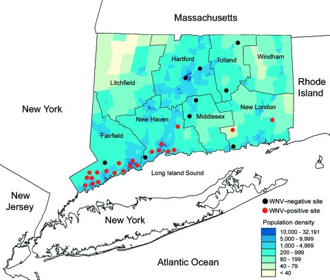

Warm-up mini-Report: Mosquito Blood Hosts in Salt Lake City, Utah
================
Noah Blake
2025-12-05

- [ABSTRACT](#abstract)
- [BACKGROUND](#background)
- [STUDY QUESTION and HYPOTHESIS](#study-question-and-hypothesis)
  - [Questions](#questions)
  - [Hypothesis](#hypothesis)
  - [Prediction](#prediction)
- [METHODS](#methods)
  - [Fill in first analysis](#fill-in-first-analysis)
- [Barplots of blood meal ID by trap locations with/without WNV positive
  mosquito
  pools](#barplots-of-blood-meal-id-by-trap-locations-withwithout-wnv-positive-mosquito-pools)
  - [Fill in second analysis/plot](#fill-in-second-analysisplot)
- [DISCUSSION](#discussion)
  - [Interpretation - fill in
    analysis](#interpretation---fill-in-analysis)
  - [Interpretation - fill in
    analysis/plot](#interpretation---fill-in-analysisplot)
- [CONCLUSION](#conclusion)
- [REFERENCES](#references)

# ABSTRACT

These data sets explore the spread and perpatuation of the West Nile
virus trough animal populations in the country. It explores many
diffrent types of animals with a large preportion being in birds. Data
was collected from sequencing blood meal samples from misquitos which
are the spreaders of this virus and this report will explore some of the
trends of this viral spread and look at areas and animals that may be
more or less susceptible to this virus. Fill in abstract at the end
after we have finished the methods, results, discussion, conclusions and
know what our data “says”.

``` r
# The knitr::include_graphics() function is the standard way to insert images
# in R Markdown, as it handles different output formats (HTML, PDF, Word).
knitr::include_graphics("Structure-of-West-Nile-Virus.png")
```

<div class="figure" style="text-align: center">


<p class="caption">

Structure of West Nile Virus as determined by cryo-electron microscopy.
</p>

</div>

# BACKGROUND

West Nile virus is transmitted via mosquito from bird to mosquito then
to human from biting. It contains a isosahderal symmetry with positive
sense Single stranded RNA. DNA extraction followed normal protocols to
pulverize and sequence data. Fill in some text here that provides
background info on the WNV system, the blood meal DNA extractions, PCR,
sequencing, etc. and the foundation for our question/hypothesis.

For example, we can use the viremia duration (Kumar et al., 2003) bar
plot (make sure to reference sources!!!) to illustrate the potential
importance of house finches in WNV transmission and as the logical
foundation for our hypothesis that house finches serve as amplifying
hosts for WNV… and the prediction that locations with more house finches
in our blood host analysis are also the same locations with higher
positive tests for WNV in mosquito pools…

NOTE: Examples of data you can plot for the background info at
<https://github.com/saarman/BIOL3070/>

``` r
# Manually transcribe duration (mean, lo, hi) from the last table column
duration <- data.frame(
  Bird = c("Canada Goose","Mallard", 
           "American Kestrel","Northern Bobwhite",
           "Japanese Quail","Ring-necked Pheasant",
           "American Coot","Killdeer",
           "Ring-billed Gull","Mourning Dove",
           "Rock Dove","Monk Parakeet",
           "Budgerigar","Great Horned Owl",
           "Northern Flicker","Blue Jay",
           "Black-billed Magpie","American Crow",
           "Fish Crow","American Robin",
           "European Starling","Red-winged Blackbird",
           "Common Grackle","House Finch","House Sparrow"),
  mean = c(4.0,4.0,4.5,4.0,1.3,3.7,4.0,4.5,5.5,3.7,3.2,2.7,1.7,6.0,4.0,
           4.0,5.0,3.8,5.0,4.5,3.2,3.0,3.3,6.0,4.5),
  lo   = c(3,4,4,3,0,3,4,4,4,3,3,1,0,6,3,
           3,5,3,4,4,3,3,3,5,2),
  hi   = c(5,4,5,5,4,4,4,5,7,4,4,4,4,6,5,
           5,5,5,7,5,4,3,4,7,6)
)

# Choose some colors
cols <- c(rainbow(30)[c(10:29,1:5)])  # rainbow colors

# horizontal barplot
par(mar=c(5,12,2,2))  # wider left margin for names
bp <- barplot(duration$mean, horiz=TRUE, names.arg=duration$Bird,
              las=1, col=cols, xlab="Days of detectable viremia", xlim=c(0,7))

# add error bars
arrows(duration$lo, bp, duration$hi, bp,
       angle=90, code=3, length=0.05, col="black", xpd=TRUE)
```


# STUDY QUESTION and HYPOTHESIS

## Questions

What geographical dynamics may cause an increase in transmission of WNV?

Fill in here, the question we want to answer… e.g. What bird species is
acting as WNV amplifying host in Salt Lake City?

## Hypothesis

IN areas where birds are more likley to drink from stagnant and dirty
water souces these species will be more likley to carry WNV

Fill in hypothesis… e.g. House finches are acting as important
amplifying hosts of WNV in Salt Lake City.

## Prediction

If Birds are more used to human interactions and they might be more
likley to be in urban environments where there may be much dirtier water
and exposure to harmful affects. this could also have an effect in
places near less developed areas due to a higher population of mosquito.

# METHODS

Collection of samples was done with mosqutio traps and blood meal
samples were collected with a lysis protocol where DNA is extracted and
then sequenced.

## Fill in first analysis

``` r
# put code for analysis here
```

# Barplots of blood meal ID by trap locations with/without WNV positive mosquito pools

Horizontal plots:

``` r
## import counts_matrix: data.frame with column 'loc_positives' (0/1) and host columns 'host_*'
counts_matrix <- read.csv("./bloodmealPLUS_BIOL3070.csv")

## 1) Identify host columns
host_cols <- grep("^host_", names(counts_matrix), value = TRUE)

if (length(host_cols) == 0) {
  stop("No columns matching '^host_' were found in counts_matrix.")
}

## 2) Ensure loc_positives is present and has both levels 0 and 1 where possible
counts_matrix$loc_positives <- factor(counts_matrix$loc_positives, levels = c(0, 1))

## 3) Aggregate host counts by loc_positives
agg <- stats::aggregate(
  counts_matrix[, host_cols, drop = FALSE],
  by = list(loc_positives = counts_matrix$loc_positives),
  FUN = function(x) sum(as.numeric(x), na.rm = TRUE)
)

## make sure both rows exist; if one is missing, add a zero row
need_levels <- setdiff(levels(counts_matrix$loc_positives), as.character(agg$loc_positives))
if (length(need_levels)) {
  zero_row <- as.list(rep(0, length(host_cols)))
  names(zero_row) <- host_cols
  for (lv in need_levels) {
    agg <- rbind(agg, c(lv, zero_row))
  }
  ## restore proper type
  agg$loc_positives <- factor(agg$loc_positives, levels = c("0","1"))
  ## coerce numeric host cols (they may have become character after rbind)
  for (hc in host_cols) agg[[hc]] <- as.numeric(agg[[hc]])
  agg <- agg[order(agg$loc_positives), , drop = FALSE]
}

## 4) Decide species order (overall abundance, descending)
overall <- colSums(agg[, host_cols, drop = FALSE], na.rm = TRUE)
host_order <- names(sort(overall, decreasing = TRUE))
species_labels <- rev(sub("^host_", "", host_order))  # nicer labels

## 5) Build count vectors for each panel in the SAME order
counts0 <- rev(as.numeric(agg[agg$loc_positives == 0, host_order, drop = TRUE]))
counts1 <- rev(as.numeric(agg[agg$loc_positives == 1, host_order, drop = TRUE]))

## 6) Colors: reuse your existing 'cols' if it exists and is long enough; otherwise generate
if (exists("cols") && length(cols) >= length(host_order)) {
  species_colors <- setNames(cols[seq_along(host_order)], species_labels)
} else {
  species_colors <- setNames(rainbow(length(host_order) + 10)[seq_along(host_order)], species_labels)
}

## 7) Shared x-limit for comparability
xmax <- max(c(counts0, counts1), na.rm = TRUE)
xmax <- if (is.finite(xmax)) xmax else 1
xlim_use <- c(0, xmax * 1.08)

## 8) Plot: two horizontal barplots with identical order and colors
op <- par(mfrow = c(1, 2),
          mar = c(4, 12, 3, 2),  # big left margin for species names
          xaxs = "i")           # a bit tighter axis padding

## Panel A: No WNV detected (loc_positives = 0)
barplot(height = counts0,
        names.arg = species_labels, 
        cex.names = .5,
        cex.axis = .5,
        col = rev(unname(species_colors[species_labels])),
        horiz = TRUE,
        las = 1,
        xlab = "Bloodmeal counts",
        main = "Locations WNV (-)",
        xlim = xlim_use)

## Panel B: WNV detected (loc_positives = 1)
barplot(height = counts1,
        names.arg = species_labels, 
        cex.names = .5,
        cex.axis = .5,
        col = rev(unname(species_colors[species_labels])),
        horiz = TRUE,
        las = 1,
        xlab = "Bloodmeal counts",
        main = "Locations WNV (+)",
        xlim = xlim_use)
```


``` r
par(op)

## Keep the colors mapping for reuse elsewhere
host_species_colors <- species_colors
```

## Fill in second analysis/plot

``` r
# put code for plotting here
```

House finch GLM:

Does house finch have an effect by location positive +/- (binary)? by
location positivity rate?

``` r
#glm with house finch alone against binary +/_
glm1 <- glm(loc_positives ~ host_House_finch,
            data = counts_matrix,
            family = binomial)
summary(glm1)
```

    ## 
    ## Call:
    ## glm(formula = loc_positives ~ host_House_finch, family = binomial, 
    ##     data = counts_matrix)
    ## 
    ## Coefficients:
    ##                  Estimate Std. Error z value Pr(>|z|)  
    ## (Intercept)       -0.1709     0.1053  -1.622   0.1047  
    ## host_House_finch   0.3468     0.1586   2.187   0.0287 *
    ## ---
    ## Signif. codes:  0 '***' 0.001 '**' 0.01 '*' 0.05 '.' 0.1 ' ' 1
    ## 
    ## (Dispersion parameter for binomial family taken to be 1)
    ## 
    ##     Null deviance: 546.67  on 394  degrees of freedom
    ## Residual deviance: 539.69  on 393  degrees of freedom
    ## AIC: 543.69
    ## 
    ## Number of Fisher Scoring iterations: 4

``` r
#glm with house-finch alone against positivity rate
glm2 <- glm(loc_rate ~ host_House_finch,
            data = counts_matrix)
summary(glm2)
```

    ## 
    ## Call:
    ## glm(formula = loc_rate ~ host_House_finch, data = counts_matrix)
    ## 
    ## Coefficients:
    ##                  Estimate Std. Error t value Pr(>|t|)    
    ## (Intercept)      0.054861   0.006755   8.122 6.07e-15 ***
    ## host_House_finch 0.027479   0.006662   4.125 4.54e-05 ***
    ## ---
    ## Signif. codes:  0 '***' 0.001 '**' 0.01 '*' 0.05 '.' 0.1 ' ' 1
    ## 
    ## (Dispersion parameter for gaussian family taken to be 0.01689032)
    ## 
    ##     Null deviance: 6.8915  on 392  degrees of freedom
    ## Residual deviance: 6.6041  on 391  degrees of freedom
    ##   (2 observations deleted due to missingness)
    ## AIC: -484.56
    ## 
    ## Number of Fisher Scoring iterations: 2

# DISCUSSION

Much of this Data helps us to see a correlation between urban
populations and where some of these species are likely to be found like
the house sparrows and Mourning doves. This leads to a higher
transmission rate in these species. supporting this is a graphic from
“Molaei G et,al”

``` r
# Insert the JPEG file directly using knitr::include_graphics()

```

<div class="figure" style="text-align: center">


<p class="caption">

West Nile Virus activity in the Northeastern United States.
</p>

</div>

## Interpretation - fill in analysis

This graphs helps to show the susceptibility of this virus across
different species of bird. Most notable to this report which explores
three commonly being influenced by this virus those being: House finch,
House Sparrow and the Mourning dove. we see much higher rates of blood
meal rates of WNV which drew us to questions about the behavioral and
morphological differences in these species that may raise their rates.

## Interpretation - fill in analysis/plot

This GLM test helps us to determine the percentage chance that these
events are statistical significant and whether their relationships can
help us to draw conclusions from this data. Notably there are extremely
low P-values which helps us to know that there is not correlation in
this data set by chance.

# CONCLUSION

While challenging to arrive at and spseific conclusions there are still
some trends here that we can see. Due to behavior patterns it seems to
be apparent that there are patterns with many species of these birds and
how they come in contact with this virus. In future studys it may be of
intrest to study these prone species birds more
(house_finch,house_sparrow and american_robin) specifically of any
morphological and an immunosuseptibulity assay.

# REFERENCES

Suchetana Mukhopadhyay et al. ,Structure of West Nile
Virus.Science302,248-248(2003).DOI:10.1126/science.1089316

Shrestha L (2022) West Nile virus (WNV)- an overview. In: Microbe Notes.
<https://microbenotes.com/west-nile-virus/>. Accessed 9 Oct 2025

Molaei G, Andreadis TG, Armstrong PM, Anderson JF, Vossbrinck CR. Host
feeding patterns of Culex mosquitoes and West Nile virus transmission,
northeastern United States. Emerg Infect Dis. 2006 Mar;12(3):468-74.
doi: 10.3201/eid1203.051004. PMID: 16704786; PMCID: PMC3291451.

ChatGPT. OpenAI, version Jan 2025. Used in search for studies along with
refinement for minor analysis codeing.
