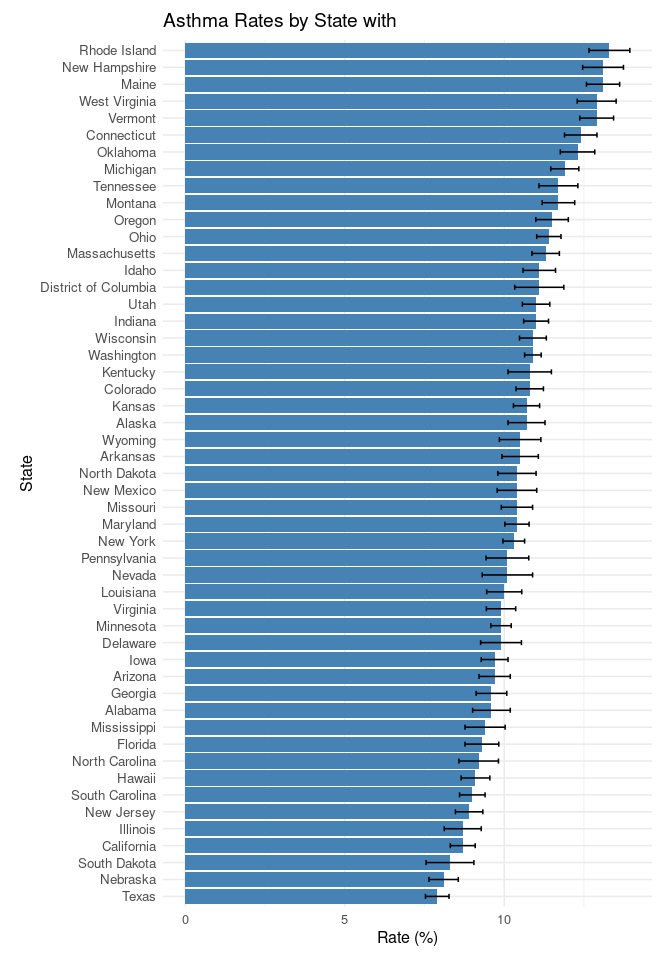

Final Project
================
Noah Blake
2025-10-28

- [R Markdown](#r-markdown)

## R Markdown

``` r
# Load required libraries
library(tidyverse)

# Read the CSV file
state_data <- read_csv("state_data.csv")

# Clean and separate the "Rate (SE)" column into two numeric columns
state_data <- state_data %>%
  separate(`Rate (SE)`, into = c("Rate", "SE"), sep = " \\(", remove = TRUE) %>%
  mutate(
    Rate = as.numeric(Rate),
    SE = as.numeric(str_remove(SE, "\\)"))
  )

# Create the plot
ggplot(state_data, aes(x = reorder(State, Rate), y = Rate)) +
  geom_col(fill = "steelblue") +
  geom_errorbar(aes(ymin = Rate - SE, ymax = Rate + SE), width = 0.3) +
  coord_flip() +
  labs(
    title = "Asthma Rates by State with ",
    x = "State",
    y = "Rate (%)"
  ) +
  theme_minimal(base_size = 12) +
  theme(
    axis.text.y = element_text(size = 10, margin = margin(r = 5)),
    plot.margin = margin(10, 15, 10, 15)
  )
```

<!-- -->
